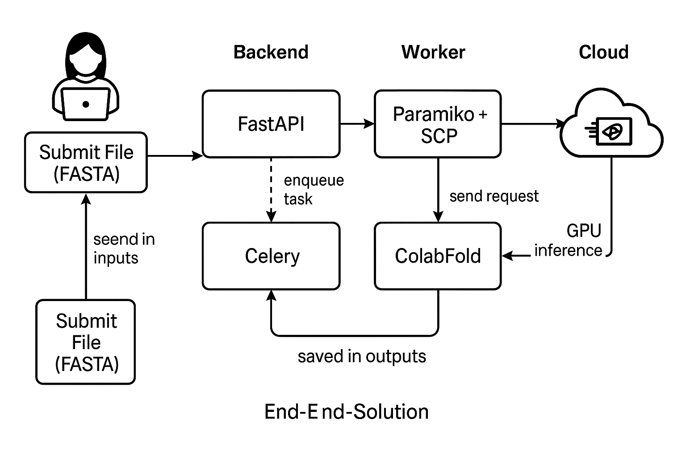

# 🧬 Protein Structure Prediction Platform (ColabFold + RunPod)

This platform enables fast and scalable protein 3D structure prediction using [ColabFold](https://github.com/sokrypton/ColabFold) (a wrapper around AlphaFold2) and remote GPU acceleration on [RunPod.io](https://www.runpod.io/). It provides:

- 🚀 Remote GPU-based inference
- ⚙️ FastAPI backend for upload and management
- 🧵 Celery worker with Redis queue for asynchronous tasks
- 📁 Local storage of uploaded and predicted results

---

## 📁 Project Structure

```
protein-predict-platform/
├── backend/                # FastAPI app (main.py)
├── worker/                 # Celery task handlers (tasks.py)
├── storage/
│   ├── inputs/             # Uploaded FASTA files
│   └── outputs/            # Downloaded PDB results from RunPod
├── docker-compose.yml      # Service orchestration
└── README.md               # This documentation
```

## 🧬 System Architecture



---

## 🔁 Workflow Overview

1. User uploads a `.fasta` file to `/submit` API.
2. Backend stores it under `storage/inputs/`.
3. Celery dispatches a task to the worker.
4. Worker:
   - Connects to RunPod via SSH
   - Uploads the input
   - Runs `colabfold_batch` inside remote GPU environment
   - Downloads prediction results (e.g., `result_model_1.pdb`)
5. Output is saved locally under `storage/outputs/<task_id>`

---

## ⚡ Quickstart

### 1. Start the Platform Locally

```bash
docker-compose up --build
```

- FastAPI available at `http://localhost:8000`
- Celery + Redis initialized automatically

---

### 2. Submit a Prediction

```bash
curl -X POST http://localhost:8000/submit \
  -F "file=@test.fasta"
```

The server will return a success response and begin processing asynchronously.

---

## 🔑 Remote GPU Access

Prediction runs remotely on a RunPod container over SSH. To configure this:

1. Set your SSH key as an environment variable:

   ```bash
   export SSH_KEY_PATH=~/.ssh/id_ed25519
   ```

2. In `worker/tasks.py`, the key will be used to connect:
   ```python
   ssh.connect("your.runpod.ip", port=PORT, username="root", key_filename=key_path)
   ```

---

## ⚠️ Prerequisites

| Component       | Requirement                          |
|-----------------|--------------------------------------|
| Python Runtime  | Dockerized (Python 3.10+)            |
| Remote Host     | RunPod container with ColabFold      |
| GPU Environment | CUDA & cuDNN correctly installed     |
| Local Tools     | Docker & Docker Compose              |

---

## 🔧 Tech Stack

| Layer       | Technology        |
|-------------|-------------------|
| API Server  | FastAPI           |
| Task Queue  | Celery + Redis    |
| Inference   | ColabFold + JAX   |
| Deployment  | Docker Compose    |
| Remote Exec | Paramiko + SCP    |

---

## 📂 Output Example

Results are downloaded automatically to:

```
storage/outputs/<uuid>/
├── result_model_1.pdb
├── scores.json
├── ranking_debug.json
```

Each prediction result is isolated in its own task-specific directory.

---

## 📄 License

 Apache 2.0 .

